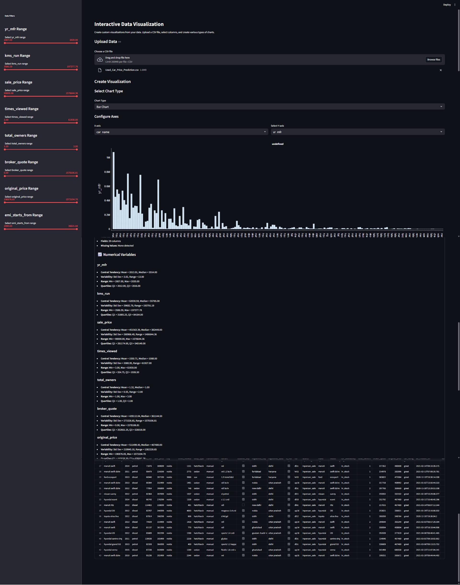
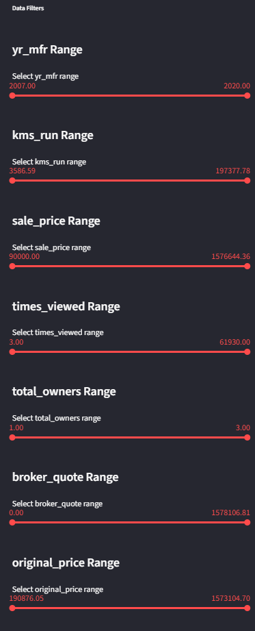
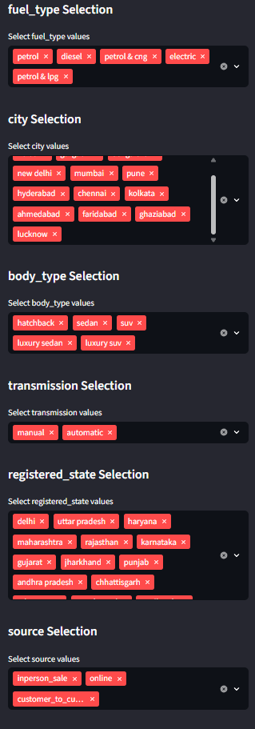
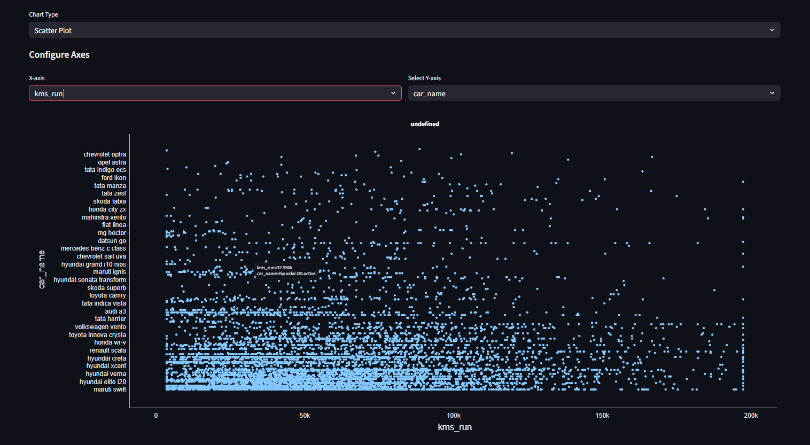
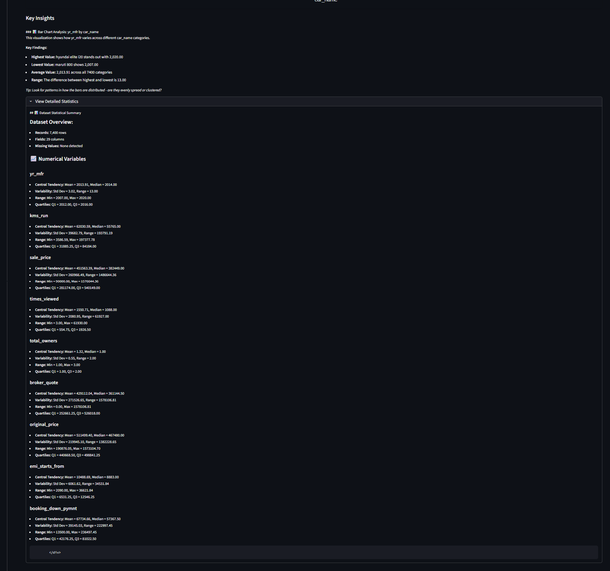

# 📊 Data Storyteller: Interactive Data Visualization Dashboard

> 🚀 A powerful, user-friendly web application for exploring, filtering, and visualizing data through interactive charts and insights.

## 📋 Overview

Data Storyteller is a sophisticated data visualization tool built with Streamlit and Plotly that allows users to upload CSV data, explore it through a comprehensive filtering system, and create various types of interactive charts with automated insights. 

The application is designed for both data analysts and business users who need to quickly derive meaningful insights from their data without complex coding.

## 📖 How to Use

### 1. Loading Data
1. Start the application and click the "Choose a CSV file" button
2. Select any CSV file from your computer
3. The data will be automatically:
   - Loaded and parsed correctly for various formats
   - Cleaned with intelligent missing value imputation
   - Processed to handle outliers based on data distributions
   - Formatted with appropriate data types
4. All cleaning happens transparently without interrupting your workflow

### 2. Filtering Data
1. Use the sidebar to access all filtering options
2. For date columns: Select date ranges using the calendar picker
3. For numeric columns: Adjust the min and max values using the sliders
4. For categorical columns: Select/deselect values using the multi-select dropdown
5. The filter summary at the bottom of the sidebar shows statistics on filtered results

### 3. Creating Visualizations
1. Select a chart type from the dropdown menu
2. Choose appropriate X and Y axes for your selected chart
3. For Scatter and Bubble charts, optionally select a size variable
4. The chart will automatically render with optimized settings
5. Review the "Key Insights" section for automatically generated observations
6. Expand "View Detailed Statistics" for comprehensive statistical analysis

### 4. Managing Data
1. Toggle "Show Raw Data" to view the filtered dataset
2. Use the "Download Filtered Data" button to export as CSV
3. The data table supports sorting and pagination for easy exploration

---

## ✨ Key Features

### 🔄 Data Management
- **⬆️ CSV Upload:** Easily upload any CSV file for instant analysis
- **🧹 Intelligent Data Cleaning:** 
  - 📅 Automatic date detection and formatting
  - 🔍 Advanced missing values imputation
  - 📊 Distribution-aware outlier treatment
  - 🧠 Smart data type handling
- **📥 Filtered Data Export:** Download your filtered dataset as a new CSV

### 🔍 Advanced Filtering System
- **📆 Date Range Filters:** For all datetime columns with intuitive date pickers
- **📏 Numeric Range Filters:** Interactive sliders for numeric data with min/max bounds
- **🏷️ Categorical Filters:** Multi-select dropdowns for categorical data (limited to columns with <50 unique values)
- **📈 Filter Summary:** Real-time statistics showing original vs. filtered row counts

### 📊 Chart Creation
- **📈 Multiple Chart Types:**
  - Bar Charts & Line Charts for trends and comparisons
  - Scatter Plots & Bubble Charts for relationship analysis
  - Box Plots & Violin Plots for distribution visualization
  - Histograms for frequency distribution
  - Pie Charts for part-to-whole comparisons
  - Area Charts for cumulative values
  - Heat Maps for correlation matrices
- **🧮 Intelligent Axis Selection:** Automatic suggestions based on data types
- **🔎 Interactive Features:** Zoom, pan, and hover details on all charts

### 📝 Automated Insights
- **💡 Chart Insights:** Automatic generation of key findings for each visualization
- **📊 Statistical Summaries:** Comprehensive statistics presented in readable format
- **📝 Data Overview:** Quick understanding of data shape, missing values, and key metrics

### 💻 User Interface
- **🖥️ Responsive Layout:** Adjusts to different screen sizes for optimal viewing
- **🔧 Compact Sidebar:** Ultra-compact filters panel with resizing capability
- **📋 Large Data Display:** Expanded view for the raw data table
- **🎨 Modern Design:** Clean, professional styling with consistent typography

---

## 🧹 Advanced Data Cleaning Pipeline

### 🧠 Adaptive Missing Values Handling
- **KNN Imputation:** 
  - For smaller datasets with correlated features
  - Utilizes neighboring data points for more accurate value estimation
  - Preserves relationships between features

- **Statistical Imputation:** 
  - Uses median for numeric columns (robust against outliers)
  - Applies mode imputation for categorical data
  - Handles high-dimensional datasets efficiently

- **Smart Selection:** 
  - Automatically chooses between methods based on dataset characteristics
  - Adapts to data size, sparsity, and column relationships
  - Optimizes for both accuracy and performance

### 📊 Distribution-Aware Outlier Treatment
- **Log Transformation:** 
  - Normalizes highly skewed data with positive values
  - Preserves relative relationships between data points
  - Improves visualization and analysis of skewed distributions

- **Winsorization:** 
  - Caps extreme values at the 1st and 99th percentiles
  - Ideal for skewed data that includes negative values
  - Retains data points while limiting their influence

- **Z-Score Capping:** 
  - Limits values to ±3 standard deviations from the mean
  - Applied for normally distributed data
  - Balances outlier handling with data integrity

### 🔄 Intelligent Processing Workflow
- **Automated Pipeline:** 
  - Non-intrusive processing without requiring user input
  - Seamless integration with data loading process

- **Type-Specific Handling:** 
  - Different strategies applied to numeric vs. categorical columns
  - Custom approaches for timestamps and other special data types

- **Special Case Preservation:** 
  - Maintains integrity of datetime columns
  - Preserves identifiers and other critical fields
  - Respects domain-specific data patterns

---

## 🛠️ Technical Architecture

### Core Components
- **📥 Data Loader:** Handles CSV import with automatic type detection and advanced intelligent cleaning
- **🔍 Filter Engine:** Dynamic filtering system that adapts to data types and column content
- **📊 Chart Creator:** Flexible visualization engine supporting multiple chart types with optimized defaults
- **📝 Insight Generator:** Automatic analysis system that extracts meaningful patterns and statistics

### 💻 Tech Stack
- **🐍 Python:** Core programming language
- **📊 Streamlit:** Web framework for interactive interface
- **🔢 Pandas:** Data manipulation and analysis
- **📈 Plotly:** Interactive chart creation
- **📊 NumPy:** Advanced numerical operations
- **🧮 Scikit-learn:** Machine learning algorithms for KNN imputation and data preprocessing
- **📏 SciPy:** Scientific computing and statistical functions
- **🔍 Custom Analytics:** Proprietary insight generation algorithms

---

## 📸 Project Screenshots

### Main Dashboard!

*The main dashboard interface showing the chart creation area and data filtering sidebar*

### Interactive Filtering

*The sidebar filtering interface showing date, numeric, and categorical filters*

### Chart Visualization Examples

### Data Analysis Features

*Detailed statistical summary with key metrics and distributions*

### Data Management

*Expanded data table view with sorting and filtering capabilities*

---

